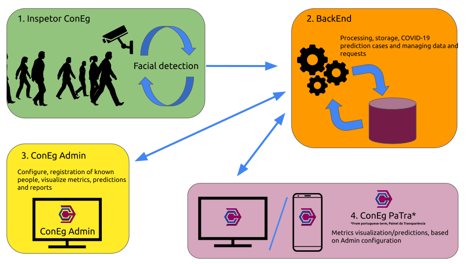

# ConEg Project
This project orchestrates all minor services into one solid build.

## Brief explanation

Amid the Covid-19 pandemic, It found that Brazil had failed to contain the spread of the virus nationwide. Fundamentally proposed by the WHO, and adopted by the country's Health agency, the use of masks and the establishment of a respiratory policy proved to be an essential measure to reduce the spread of SARS-Cov-2 when in contact with other people. The ConEg (which means in Portuguese "Controle Epidemiológico de Grupo") system provides data and metrics that aim to help commercial and state entities to achieve greater control over their population, making it possible to alert members who do not comply with the sanitary measures imposed and/or generate temporal forecasts of the possible quantity of new cases of Covid-19 in the city where the system is installed.

High-level system diagram

In order to explain how information/data moves throughout the system, here's the architecture diagram of it.

System Architecture